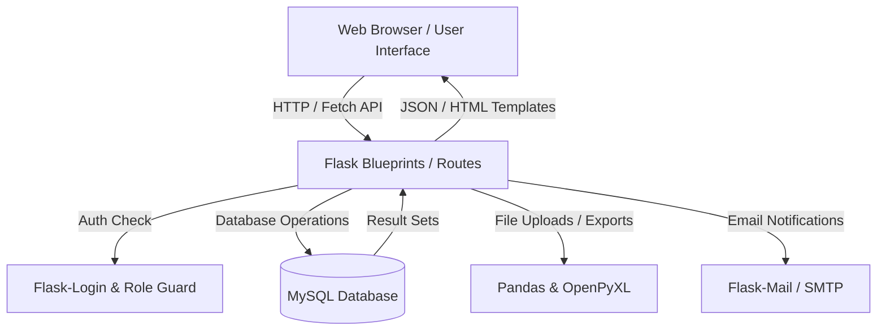

# Audit Avengers - Audit Tracking & Management System

[](https://www.python.org/)
[](https://flask.palletsprojects.com/)
[](https://www.mysql.com/)
[](LICENSE)

A clean, scalable Flask-based web application designed to streamline audit tracking, auditor assignments, manual audit creation, bulk Excel uploads, and automated report exports.

---

## 📌 Project Overview

**Audit Avengers** solves the challenge of managing multi-industry audits across dispersed teams and auditors. It provides centralized administrative oversight alongside an auditor application workflow.

- **Primary Goal**: Replace manual spreadsheet management with a centralized web interface for scheduling, tracking, assigning, and reporting audits.
- **Target Audience**: Audit Administrators, Quality Assurance Managers, and External/Internal Field Auditors.

---

## ✨ Key Features

- 🔐 **Role-Based Authentication & Access Control**
  - Secure login/signup system with role separation (`admin` vs `auditor`).
  - Session management and custom role-based route guards (`@only_one('admin')`).

- 📊 **Admin Dashboard & Analytics**
  - High-level metrics showing total, active, pending, and completed audits.
  - Quick view of recent audit assignments and real-time status updates.

- 📝 **Audit Creation & Data Management**
  - **Manual Entry**: Interactive forms to log individual audit details (Audit ID, industry, location, auditor requirements, equipment, etc.).
  - **Bulk Excel Import**: Parse and batch insert audit data directly from Excel files.

- 🧑‍💻 **Auditor Application Portal**
  - Interactive auditor profile management and audit application workflow.
  - State and qualification-based auditor matching.

- 📥 **Reporting & Export Capabilities**
  - Automated report compilation and Excel download (`.xlsx`) via Pandas and OpenPyXL.
  - Complete database backup dumps available for schema replication.

- 📧 **Automated Communication & Support**
  - Contact form integration with email delivery via SMTP (Flask-Mail).

---

## 🛠️ Technology Stack

| Domain | Technology |
| :--- | :--- |
| **Backend** | Python 3.9+, Flask, Flask-Login, Flask-Session, Flask-Mail |
| **Database** | MySQL (`mysql-connector-python`, PyMySQL) |
| **Frontend** | HTML5, Vanilla CSS3, JavaScript (ES6 Fetch API) |
| **Data & Reports** | Pandas, OpenPyXL |
| **Deployment & Server** | Gunicorn, Docker |
| **Testing** | pytest |

---

## 🏗️ Architecture & Application Flow



---

## 📁 Project Structure

```text
AuditAvengers/
├── audit_tracker/              # Main Application Package
│   ├── __init__.py             # Application Factory (create_App)
│   ├── config.py               # Database Connection Helper
│   ├── auth.py                 # Authentication & User Loader Blueprint
│   ├── admin_report.py         # Admin Dashboard & Metrics Blueprint
│   ├── audit_log.py            # Audit Creation & Details Blueprint
│   ├── apply.py                # Auditor Application Blueprint
│   ├── auditor_page.py         # Auditor Profile & Status Blueprint
│   ├── upload.py               # Excel Bulk Upload Blueprint
│   ├── down_report.py          # Report Export & Download Blueprint
│   ├── smtp.py                 # Email Notification Blueprint
│   ├── whatsappweb.py          # Application & Contact Workflow Blueprint
│   ├── database.py             # Database Utilities Blueprint
│   ├── test.py                 # Role Authorization Decorator (@only_one)
│   ├── mail_config.py          # Flask-Mail Instance Initialization
│   ├── static/                 # Static Assets
│   │   ├── css/                # Custom Stylesheets (loginStyle.css)
│   │   ├── js/                 # Modular JS Controllers
│   │   └── 2.png               # Application Brand Assets
│   └── templates/              # HTML5 Jinja Templates
├── db_backup/                  # SQL Schema & Data Backups
│   └── Dump20250522/           # MySQL Database Dumps
├── tests/                      # Automated Unit & Integration Tests
│   ├── test_app.py
│   ├── test_auth.py
│   └── application_test.py
├── .env.example                # Environment Variable Template
├── .gitignore                  # Git Ignore Rules
├── Dockerfile                  # Container Deployment Configuration
├── Procfile                    # Production WSGI Process Command
├── requirements.txt            # Python Dependencies
└── run.py                      # Application Entry Point
```

---

## 🚀 Installation & Setup

### Prerequisites

- Python 3.9 or higher
- MySQL Server (Local or Remote)

### 1. Clone the Repository

```bash
git clone https://github.com/Rajesh-koneru/AuditAvengers.git
cd AuditAvengers
```

### 2. Create and Activate a Virtual Environment

**Windows (PowerShell):**
```powershell
python -m venv venv
.\venv\Scripts\activate
```

**Linux / macOS:**
```bash
python3 -m venv venv
source venv/bin/activate
```

### 3. Install Dependencies

```bash
pip install -r requirements.txt
```

### 4. Configure Environment Variables

Copy `.env.example` to create a `.env` file in the project root:

```bash
cp .env.example .env
```

Edit `.env` with your actual database and email credentials:

```ini
DB_HOST=127.0.0.1
DB_PORT=3306
DB_USER=root
DB_PASSWORD=your_mysql_password
DB_NAME=AuditTracker
SECRET_KEY=your_secure_secret_key
ADMIN_USERNAME=Admin
ADMIN_PASSWORD=Admin@1234
MAIL_USERNAME=your_email@gmail.com
MAIL_PASSWORD=your_app_password
```

---

## 🗄️ Database Setup

1. Log into your MySQL database server:
   ```bash
   mysql -u root -p
   ```
2. Create the database:
   ```sql
   CREATE DATABASE AuditTracker;
   ```
3. Import table schemas and initial data from the `db_backup` folder:
   ```bash
   mysql -u root -p AuditTracker < db_backup/Dump20250522/audittracker_audit_details.sql
   mysql -u root -p AuditTracker < db_backup/Dump20250522/audittracker_auditor_details.sql
   mysql -u root -p AuditTracker < db_backup/Dump20250522/audittracker_applications.sql
   mysql -u root -p AuditTracker < db_backup/Dump20250522/audittracker_audit_report.sql
   ```

---

## 🏃 Running the Application

### Development Server

Start the Flask development server:

```bash
python run.py
```

Access the application in your browser at: `http://127.0.0.1:5000`

### Production Server (Gunicorn)

```bash
gunicorn run:app
```

---

## 🧪 Testing

Run the automated test suite using `pytest`:

```bash
pytest
```

All unit and integration tests are located under the `tests/` directory.

---

## 🛡️ Security Best Practices

- **Environment Isolation**: Credentials, database passwords, and secret keys are managed through environment variables (`.env`).
- **Access Control**: Role-based access control enforces administrative permissions on restricted endpoints via `@only_one('admin')`.
- **Password Hashing**: Auditor authentication utilizes Werkzeug security helpers for hashed password verification.

---

## 🔮 Future Enhancements

- 📊 Interactive data visualization charts for audit progress.
- 📱 SMS / Instant Messaging alerts for audit status changes.
- 🌐 Multi-tenant client portals for real-time audit request submissions.

---

## 📄 License

This project is open source and available under the [MIT License](LICENSE).
